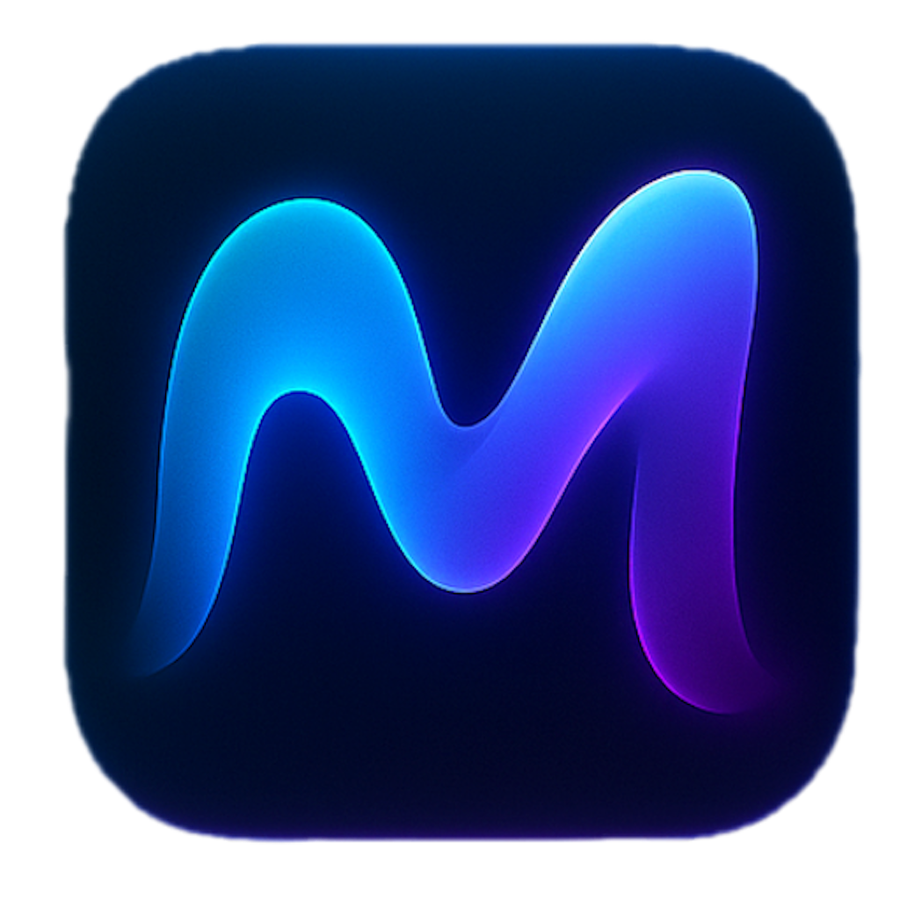

# MirageVD

MirageVD is a lightweight virtual display solution for macOS that allows you to create an additional screen sharing zone without needing physical hardware.

**Share only what matters in online meetings**

Create a region, and share it in Teams, Zoom and other meeting apps.  
Simpler than heavy streaming software, and more flexible than Window sharing.

---

## Download

**[Download for Mac](https://github.com/ashajjar/miragevd/releases)**

---

## How it works — 3 steps

### 1. Select a region
Draw a rectangle anywhere on your screen.

<video width="100%" controls>
  <source src="assets/1-select.mp4" type="video/mp4">
  Your browser does not support the video tag.
</video>

### 2. Capture the selected region
MirageVD creates a window with the selected region.

<video width="100%" controls>
  <source src="assets/2-create.mp4" type="video/mp4">
  Your browser does not support the video tag.
</video>

### 3. Share the captured region
Choose MirageVD display and present safely.

<video width="100%" controls>
  <source src="assets/3-share.mp4" type="video/mp4">
  Your browser does not support the video tag.
</video>

---

## Professional, and pleasant screen sharing experience

MirageVD helps you exactly share what you want to share in online meetings

### Privacy-First Sharing
No more notifications, tabs, or personal info leaking into your presentations.

### Multi-App Sharing
Unlike "Share Window" option in most apps, MirageVD lets you show **multiple apps at once** inside one clean region.

### Lightweight & Simple
Faster and easier than streaming software — no scenes, no heavy CPU load, just instant region sharing.

### Made for Ultrawide Users
Keep your desk clean with one monitor, and share only the slice they need to see.

### Secure & Trusted
Native Mac app, notarized by Apple, with payments handled via Paddle (the same checkout trusted by indie Mac apps like BetterTouchTool).

---

## Frequently Asked Questions

### Is MirageVD free?

Yes. MirageVD is free forever.

### Why not just use "Share Window" in Teams/Zoom?

Window sharing works if you only need one app. MirageVD is for cases where you need **multiple apps visible at once** (e.g. IDE + browser + terminal). You can show just what matters, nothing else.

### Why not just use OBS, DeskPad, or other tools?

Those apps are powerful and great for advanced use cases. But sometimes you don't need all the extra features — you just want to share a clean region of your screen quickly. MirageVD is built to do exactly that: lightweight, simple, and focused on everyday screen sharing.

### Is this Mac only?

Yes. macOS doesn't have a built-in region-to-share feature. MirageVD fills that gap.

### Is it safe to install?

Yes. MirageVD is a notarized Mac app, with payments handled securely via Paddle (trusted and widely used checkout provider).

---

## Get started in under a minute

1. **Download the MirageVD installer.**
2. **Open the .dmg and drag MirageVD to Applications.**
3. **Grant Screen Recording permission.**
4. **Draw a rectangle and start sharing in Teams.**

**[Download for Mac](https://github.com/ashajjar/miragevd/releases)**

---

## Support

For feature requests or support contact me here [contact@ahmadhajjar.me](mailto:contact@ahmadhajjar.me), or simply write an issue here **[issues](https://github.com/ashajjar/miragevd/issues)**

---

## About

### Technical Details

- **Application Category**: Business Application
- **Operating System**: macOS
- **Software Version**: 1.9.1
- **Security**: Notarized by Apple
- **Payment**: Secure checkout via Paddle

---

*Last updated: 2024*

